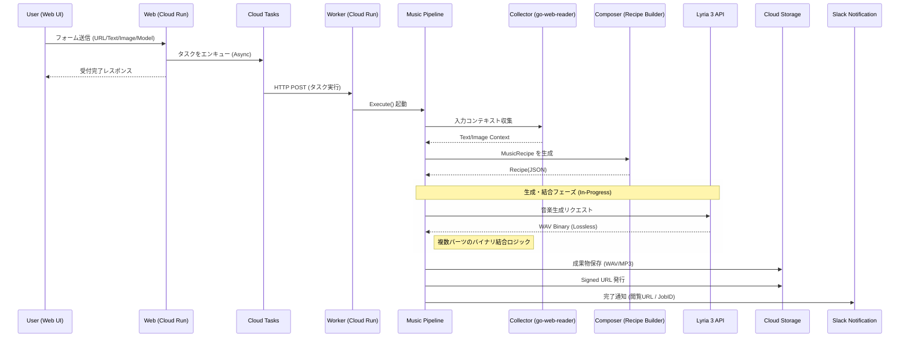

# 🎼 AP Music

[](https://golang.org/)
[](https://golang.org/)
[](https://github.com/shouni/ap-music/tags)
[](https://opensource.org/licenses/MIT)
[](#)

> [!WARNING]
> **現在このプロジェクトは活発に開発中（WIP）です。**
> アーキテクチャ設計とインターフェース定義を先行して進めており、実装の一部はプレースホルダー、またはモックの状態です。破壊的な変更が頻繁に行われる可能性があるため、プロダクション環境での利用にはご注意ください。

## 🚀 概要 (About) - 音楽生成のWebオーケストレーター

**AP Music** は、音楽生成コア機能（`Lyria 3 Pro` + `Music Recipe`）を **Cloud Run** および **Google Cloud Tasks** で Web アプリケーション化し、非同期にオーケストレーションするためのプロジェクトです。

本プロジェクトの最大の特徴は、**Lyria 3 Pro による WAV 直接出力**と、**独自開発のバイナリ結合ロジック**を組み合わせた高品質な音声生成パイプラインです。複数の楽曲パーツを並列生成し、ロスレスで統合することで、複雑な構成の楽曲生成を高速かつ安定して実現します。

---

## 🎨 ワークフロー (Workflows)

| 画面 (Command) | 役割 | 主な入力 / 出力 |
| --- | --- | --- |
| **Compose** | URL / 文章 / 画像から楽曲設計図（Music Recipe）を生成 | URL・Text・Image / JSON (Recipe) |
| **Generate** | Recipe に基づき、WAV パーツを生成・結合 | Recipe / **WAV (Lossless)** |
| **Publish** | 成果物の保存と署名付き URL の発行 | WAV / Signed URL |
| **Notify** | Slack への実行完了通知 | Job Result / Slack Message |

### 💻 実行フロー (Workflow)

1. **Request**: ユーザーが Web フォームから入力を送信。
2. **Enqueue**: `CloudTasksAdapter` がジョブを非同期投入。
3. **Worker**: Worker Handler がタスクを受信し `MusicPipeline` を起動。
4. **Pipeline**:
    - **Phase 1: Collect**: `go-web-reader` で入力コンテキスト収集。
    - **Phase 2: Compose**: LLM で `MusicRecipe` 生成。
    - **Phase 3: Generate**: `Lyria 3` で MP3 生成。
    - **Phase 4: Publish/Notify**: GCS/Local 保存、Signed URL 発行、Slack 通知。

---

## 🏗 アーキテクチャ設計 (Architecture)

本プロジェクトは、**Hexagonal Architecture (Ports and Adapters)** と  
**Serverless Orchestration (Cloud Run + Cloud Tasks)** を組み合わせた構成です。

1. **Domain 層 (The Core)**
   - `MusicRecipe`, `Task`, `PublishResult` など、外部技術に依存しないドメインモデルとポートを定義。
2. **Pipeline 層 (Orchestrator)**
   - Collect → Compose → Generate → Publish を統制し、処理順序とエラーハンドリングを担う。
3. **Server 層 (Entry Points)**
   - Web Handler: リクエスト受付とタスク投入。
   - Worker Handler: Cloud Tasks から受けたジョブを実行。
4. **Adapters 層 (Infrastructure)**
   - Lyria API / GCS / Slack / Cloud Tasks など外部サービスとの接続実装。
5. **Builder 層 (Dependency Injection)**
   - Web 実行系と Worker 実行系を用途別に組み立てる DI コンテナ。

---

## 🏗 プロジェクトレイアウト (Project Layout)

```text
ap-music/
├── assets/                     # 埋め込みリソース管理
│   ├── assets.go               # embed.FS による静的ファイル管理
│   ├── prompts/                # LLM用システムプロンプト (prompt_recipe.md)
│   └── templates/              # Web UI 用 HTML テンプレート (layout / form)
├── internal/
│   ├── adapters/               # 外部サービス・SDK の具象実装 (Adapters)
│   │   ├── lyria.go            # Lyria 3 API を用いた音楽生成
│   │   ├── queue.go            # Cloud Tasks へのジョブ投入
│   │   ├── reader.go           # go-web-reader によるコンテンツ収集
│   │   ├── publisher.go        # 成果物の保存と署名付き URL 発行
│   │   └── slack.go            # Slack Webhook 通知
│   ├── app/                    # アプリケーション共通のライフサイクル / コンテナ
│   │   └── app.go              # Container 構造体定義
│   ├── builder/                # DI Container（依存関係の組み立て）
│   │   ├── app.go              # アプリ基盤のビルド
│   │   ├── handlers.go         # HTTP ハンドラーの組み立て
│   │   ├── io.go               # RemoteIO 関連の初期化
│   │   ├── pipeline.go         # MusicPipeline の組み立て
│   │   └── task.go             # TaskEnqueuer の初期化
│   ├── config/                 # 設定管理
│   │   ├── config.go           # Config 構造体定義
│   │   └── config_helpers.go   # 環境変数読み込み補助
│   ├── domain/                 # ドメインモデルとインターフェース (Ports)
│   │   ├── music_recipe.go     # 楽曲設計図の定義
│   │   ├── task.go             # ジョブ・タスクモデル
│   │   ├── service.go          # 音楽生成エンジンの Port
│   │   ├── repository.go       # ストレージ・公開の Port
│   │   └── notification.go     # 通知サービスの Port
│   ├── pipeline/               # ワークフローのオーケストレーション
│   │   ├── music_pipeline.go   # Collect -> Compose -> Generate -> Publish の統制
│   │   └── workflow.go         # Pipeline インターフェース定義
│   ├── prompts/                # プロンプト構築ロジック
│   │   └── recipe_builder.go   # MusicRecipe 構築用プロンプト生成
│   └── server/                 # HTTP サーバー
│       ├── handlers/           # Web ハンドラー / Worker ハンドラー
│       │   ├── handler.go      # Web UI 用ロジック
│       │   └── task_handler.go # Cloud Tasks ジョブ実行ロジック
│       ├── router.go           # chi によるルーティング定義
│       └── server.go           # サーバーの起動・シャットダウン管理
└── main.go                     # 【起点】アプリのブートストラップ（初期化・起動）
```

---

## 🔄 シーケンスフロー (Sequence Flow)



---

## ✨ 技術スタック (Technology Stack)

| 要素 | 技術 / ライブラリ | 役割 |
| --- | --- | --- |
| **言語** | **Go (Golang)** | Web サーバーおよびワーカー実装 |
| **Web** | **Cloud Run** | Web UI/API と Worker の実行基盤 |
| **非同期実行** | **Google Cloud Tasks** | 楽曲生成ジョブの非同期キューイング |
| **コンテキスト収集** | **go-web-reader** | URL / 画像の収集と抽出 |
| **音楽生成** | **Lyria 3 API** | Recipe ベースの音楽生成 |
| **結果保存** | **go-remote-io / GCS** | MP3 保存、署名付き URL 発行 |
| **通知** | **Slack Webhook** | 実行完了通知 |

---

## 🚀 使い方 (Usage)

### 1. Web 経由の基本フロー

1. Web UI で入力（URL/Text/Image）とモデルを指定。
2. ジョブ送信後、Cloud Tasks へ非同期投入。
3. Worker が楽曲生成し、保存先 URI と Signed URL を発行。
4. Slack 通知で結果を受け取る。

### 2. 主要な環境変数

| 環境変数 | 必須 | 説明 |
| --- | :---: | --- |
| `SERVICE_URL` | 必須 | アプリの公開 URL |
| `GCP_PROJECT_ID` | 必須 | GCP プロジェクト ID |
| `GCP_LOCATION_ID` | 必須 | 使用リージョン |
| `CLOUD_TASKS_QUEUE_ID` | 必須 | Cloud Tasks キュー名 |
| `SERVICE_ACCOUNT_EMAIL` | 必須 | タスク実行に使うサービスアカウント |
| `TASK_AUDIENCE_URL` | 任意 | OIDC Audience (認証が必要な場合) |
| `GCS_MUSIC_BUCKET` | 必須 | 生成 MP3 の保存先バケット |
| `LYRIA_MODEL` | 任意 | 使用する Lyria モデル名 (デフォルト値がある場合) |
| `SLACK_WEBHOOK_URL` | 任意 | 完了通知先 Webhook URL |

---

## 🔗 エコシステム連携 (Evolution)

- **[AP Chain](https://github.com/shouni/ap-chain) 連携**: 構造化ドキュメントからテーマ曲を自動生成。
- **[AP Voice](https://github.com/shouni/ap-voice) 連携**: ナレーション音声と BGM を合成し音声コンテンツ化。
- **[AP Manga Web](https://github.com/shouni/ap-manga-web) 連携**: 作品ページやシーンごとのBGMを非同期生成。

---

## 📜 ライセンス (License)

このプロジェクトは [MIT License](https://opensource.org/licenses/MIT) の下で公開されています。
