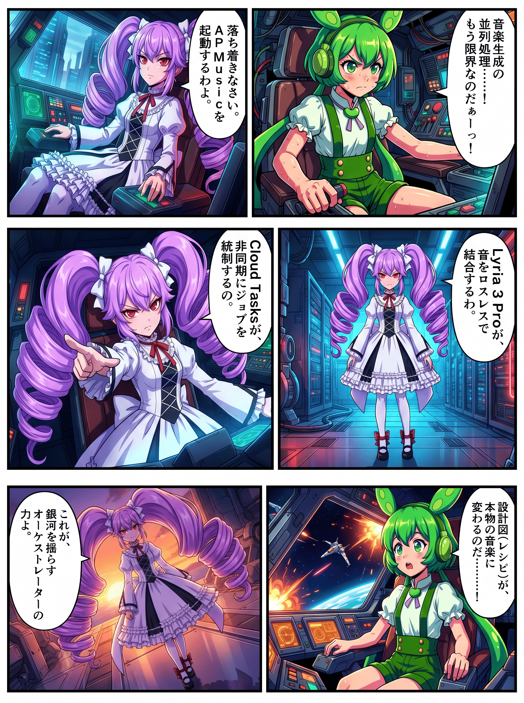
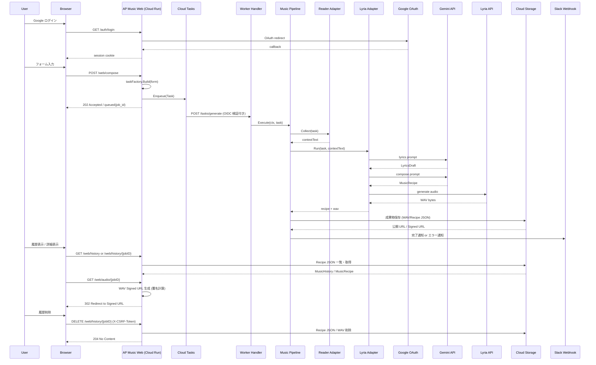

# 🎼 AP Music

[](https://golang.org/)
[](https://cloud.google.com/run)
[](https://golang.org/)
[](https://github.com/shouni/ap-music/tags)
[](https://opensource.org/licenses/MIT)
[](https://goreportcard.com/report/github.com/shouni/ap-music)
[](#)

## 🚀 概要 (About) - 音楽生成のWebオーケストレーター

**AP Music** は、音楽生成コア機能（`Lyria 3 Pro` + `Music Recipe`）を **Cloud Run** および **Google Cloud Tasks** で Web アプリケーション化し、非同期にオーケストレーションするためのプロジェクトです。

本プロジェクトの最大の特徴は、**Lyria 3 Pro による WAV 直接出力**と、**独自開発のバイナリ結合ロジック**を組み合わせた高品質な音声生成パイプラインです。複数の楽曲パーツを並列生成し、ロスレスで統合することで、複雑な構成の楽曲生成を高速かつ安定して実現します。

### 🎨 概要イメージ



---

## ✨ コア・コンセプト (Core Concepts)

**"Designed for 'Techno-Futurism': 技術ドキュメントを、90s デジタル・レイヴの疾走感とともに音声化する特化型オーケストレーター"**

本プロジェクトは、大規模な楽曲生成パイプラインにおいて「音楽的クオリティ」と「システム的堅牢性」を両立させるため、以下の4つの柱を基盤としています。

### 🧬 3-Factor Music Consistency
Lyria 3 Pro のポテンシャルを極限まで引き出し、生成される楽曲の「質感」と「構成」を厳密に制御（Control）します。
* **Seed Determinism**: 楽曲の乱数シードを厳密に管理。同一の `MusicRecipe` に対し、再現可能な生成結果を保証。
* **Stylistic Prompting**: 90年代のデジタルサウンド（Supersaw, 16-bit Arpeggio等）を言語的に定義し、AIに音楽的文脈を強制注入。
* **Vocal Articulation**: セクションごとの熱量指定と「passionate enunciation」の強制注入により、グローバルモデルから「熱き日本語の魂」を呼び起こす。

### 🛡 Production-Ready Concurrency Control
APIの物理的制約を超え、決して「止まらない、壊れない」パイプラインを標準装備しています。
* **Rate Limiting**: `golang.org/x/time/rate` によって Lyria API 呼び出し頻度を制御。API クォータを遵守し、`RESOURCE_EXHAUSTED` (429) エラーを未然に封殺。
* **Resilient Retry**: 一時的なネットワーク障害やタイムアウトに対し、Exponential Backoff（指数バックオフ）による戦略的再試行を適用し、ジョブの完走を死守。

### ⚡ Smart Request & Stream Management
オーバーヘッドを極限まで削ぎ落とし、生成コストとスループットを最適化します。
* **Singleflight Sync**: `golang.org/x/sync/singleflight` を実装。並列処理中の重複リクエストを単一の実行に集約し、APIリソースの浪費を排除。
* **Lossless Binary Merging**: 分割生成された WAV セクションを、デコードなしでバイナリレベルで直接結合。世代損失（音質劣化）をゼロに抑えた長尺楽曲構成を実現。

### 🌍 Cloud-Native Orchestration
Google Cloud のマネージドパワーをフル活用した、モダンなサーバーレス・アーキテクチャ。
* **Autoscaling Run**: Cloud Run による需要に応じたオンデマンドな計算リソースの展開。
* **Async Orchestration**: Cloud Tasks による非同期キューイング。数分間に及ぶ生成処理をバックグラウンドへ完全に隠蔽し、シームレスなUXを提供。
* **Artifact Recovery UX**: GCS に保存された `Recipe JSON` と `WAV` を履歴画面から再参照し、署名付き URL 経由で安全に再生。不要な履歴は CSRF 保護付きの削除操作で GCS から整理可能。

---

## 🎨 ワークフロー (Workflows)

| 画面 (Command) | 役割 | 主な入力 / 出力 |
| --- | --- | --- |
| **Compose** | URL / 文章 / 画像から楽曲設計図（Music Recipe）を生成 | URL・Text・Image / JSON (Recipe) |
| **Generate** | Recipe に基づき、WAV パーツを生成・結合 | Recipe / **WAV (Lossless)** |
| **Publish** | 成果物の保存と署名付き URL の発行 | WAV / Signed URL |
| **History** | GCS 上の生成履歴を一覧・詳細表示し、音声プレビューと削除操作を提供 | Job ID / Audio Preview・Recipe JSON |
| **Notify** | Slack への実行完了通知 | Job Result / Slack Message |

### 💻 実行フロー (Workflow)

1. **Request**: ユーザーが Web フォームから入力を送信。
2. **Enqueue**: `tasks.Enqueuer` がジョブを Cloud Tasks に非同期投入。
3. **Worker**: Worker Handler がタスクを受信し `MusicPipeline` を起動。
4. **Pipeline**:
   - **Phase 1: Collect**: `go-web-reader` で入力コンテキスト収集。
   - **Phase 2: Lyrics**: 作詞AIがキーワード抽出と歌詞案を生成。
   - **Phase 3: Compose**: 作曲AIが歌詞案を解釈して `MusicRecipe` を生成。
   - **Phase 4: Generate**: `Lyria 3` で WAV 生成。
   - **Phase 5: Publish/Notify**: GCS に `WAV` と `Recipe JSON` を保存し、Signed URL を発行して Slack 通知。
5. **History**: 認証済みユーザーは `/web/history` から生成済みジョブを一覧し、詳細画面で音声再生・レシピ確認・JSONコピー・履歴削除が可能。

---

## 🏗 アーキテクチャ設計 (Architecture)

本プロジェクトは、**Hexagonal Architecture (Ports and Adapters)** と  
**Serverless Orchestration (Cloud Run + Cloud Tasks)** を組み合わせた構成です。

1. **Domain 層 (The Core)**
   - `MusicRecipe`, `Task`, `PublishResult` など、外部技術に依存しないドメインモデルとポートを定義。
2. **Pipeline 層 (Orchestrator)**
   - Collect → Lyrics → Compose → Generate → Publish を統制し、処理順序とエラーハンドリングを担う。
3. **Server 層 (Entry Points)**
   - Auth Handler: Google OAuth ログインとセッション管理。
   - Web Handler: 認証済みユーザーからのリクエスト受付とタスク投入。
   - Worker Handler: Cloud Tasks から受けたジョブを実行。
4. **Adapters 層 (Infrastructure)**
   - Lyria API / GCS / Slack / Cloud Tasks など外部サービスとの接続実装。
5. **Builder 層 (Dependency Injection)**
   - Web 実行系と Worker 実行系を用途別に組み立てる DI コンテナ。
6. **Repository 層 (Data Access)**
   - GCS 上の成果物一覧・レシピ取得・削除を担当し、履歴画面と詳細画面へ永続化済みデータを供給。

---

## 🏗 プロジェクトレイアウト (Project Layout)

```text
ap-music/
├── main.go                 # エントリーポイント
├── Dockerfile              # Cloud Run 向けコンテナ定義
├── assets/                 # embed.FS で配布する静的資産
│   ├── prompts/            # 作詞・作曲用プロンプトテンプレート
│   └── templates/          # Web UI テンプレート
├── docs/                   # README / ドキュメント用の補助資料
└── internal/
    ├── adapters/           # Gemini / Lyria / GCS / Slack など外部サービス接続
    ├── app/                # DI コンテナと共有リソース定義
    ├── builder/            # Config から依存関係を構築
    ├── config/             # 環境変数ロードと設定検証
    ├── domain/             # ドメインモデルと Port 定義
    ├── pipeline/           # Collect -> Run -> Publish -> Notify のユースケース統制
    ├── repository/         # GCS 上の履歴一覧・レシピ取得・削除
    └── server/             # HTTP サーバー、ルーティング、ハンドラー
```

---

## 🔄 シーケンスフロー (Sequence Flow)



---

## ✨ 技術スタック (Technology Stack)

| 要素 | 技術 / ライブラリ | 役割 |
| --- | --- | --- |
| **言語** | **Go (Golang)** | Web サーバーおよびワーカー実装 |
| **Web** | **Cloud Run** | Web UI/API と Worker の実行基盤 |
| **非同期実行** | **Google Cloud Tasks** | 楽曲生成ジョブの非同期キューイング |
| **コンテキスト収集** | **go-web-reader** | URL コンテンツの収集と入力コンテキストの組み立て |
| **音楽生成** | **Lyria 3 API** | Recipe ベースの音楽生成 |
| **結果保存** | **go-remote-io / GCS** | WAV / Recipe JSON 保存、署名付き URL 発行 |
| **履歴管理** | **GCS Repository** | 保存済み Recipe JSON の一覧・詳細取得、Recipe JSON / WAV の削除 |
| **通知** | **Slack Webhook** | 実行完了通知 |
| **HTTP ルーティング** | **chi** | Web / Auth / Worker ルートの構成 |
| **UI** | **Bootstrap / Bootstrap Icons** | フォーム、履歴、詳細、音声プレビュー表示 |

---

## 🚀 使い方 (Usage)

### 1. Web 経由の基本フロー

1. Google OAuth でログインします。
2. `/` のフォームで入力ソースを 1 つ以上指定します。
3. 必要なら `compose_mode`、`lyrics_model`、`compose_model`、`seed` を指定します。
4. 送信後、ジョブは Cloud Tasks に投入され、レスポンスは HTML または JSON (`{"status":"queued","job_id":"..."}`) で返ります。
5. Worker が生成処理を実行し、GCS 上の `WAV` と `Recipe JSON` の Signed URL を Slack に通知します。
6. `/web/history` から過去の生成ジョブを一覧し、詳細画面で音声プレビュー、楽曲構成、歌詞、入力用 JSON を確認できます。
7. 不要な履歴は一覧または詳細画面の削除ボタンから削除できます。削除リクエストは `DELETE /web/history/{jobID}` に `X-CSRF-Token` を付けて送信され、GCS 上の `Recipe JSON` と `WAV` を削除します。

### 2. 入力と生成オプション

フォームでは次の項目を受け付けます。

| 項目 | 必須 | 説明 |
| --- | :---: | --- |
| `url` | 任意 | 参照元 URL。本文は `go-web-reader` で収集されます |
| `text` | 任意 | コンセプト文や歌詞ドラフト |
| `image` | 任意 | 参照画像 URL。入力コンテキストに URL として追加されます |
| `compose_mode` | 任意 | `assets/prompts/compose_*.md` から動的に読まれるプロンプトモード |
| `lyrics_model` | 任意 | 作詞・レシピ生成に使うテキストモデル |
| `compose_model` | 任意 | 音声生成モデル名 |
| `seed` | 任意 | 再現性のためのシード値。空ならランダム |

`url` / `text` / `image` のうち少なくとも 1 つは必要です。

### 3. 主要な環境変数

| 環境変数 | 必須 | 説明 |
| --- | :---: | --- |
| `PORT` | 任意 | HTTP サーバーの待受ポート。既定値: `8080`（Cloud Run環境では自動注入） |
| `SERVICE_URL` | 必須 | アプリの公開 URL。本番では HTTPS 必須 |
| `GCP_PROJECT_ID` | 必須 | GCP プロジェクト ID |
| `GCP_LOCATION_ID` | 必須 | 使用リージョン |
| `CLOUD_TASKS_QUEUE_ID` | 必須 | Cloud Tasks キュー名 |
| `SERVICE_ACCOUNT_EMAIL` | 必須 | タスク実行に使うサービスアカウント |
| `TASK_AUDIENCE_URL` | 任意 | Cloud Tasks の OIDC Audience。未指定時は `SERVICE_URL` |
| `GCS_MUSIC_BUCKET` | 必須 | 生成 WAV の保存先バケット |
| `GEMINI_API_KEY` | 必須 | Gemini / Lyria 呼び出しに使う API キー |
| `GEMINI_MODEL` | 任意 | 作詞・作曲フェーズの既定モデル。既定値: `gemini-3-flash-preview` |
| `LYRIA_MODEL` | 任意 | 音声生成フェーズの既定モデル。既定値: `lyria-3-pro-preview` |
| `MAX_CONCURRENCY` | 任意 | Lyria 音声生成の最大並列数。既定値: `5` |
| `RATE_INTERVAL_SEC` | 任意 | Lyria API 呼び出し間隔（秒）。既定値: `10` |
| `SLACK_WEBHOOK_URL` | 任意 | 完了通知先 Webhook URL |
| `GOOGLE_CLIENT_ID` | 必須 | Google OAuth Client ID |
| `GOOGLE_CLIENT_SECRET` | 必須 | Google OAuth Client Secret |
| `SESSION_SECRET` | 必須 | セッション署名キー |
| `SESSION_ENCRYPT_KEY` | 必須 | セッション暗号化キー。16 / 24 / 32 バイト |
| `ALLOWED_EMAILS` | 条件付き必須 | ログイン許可メールアドレス一覧（カンマ区切り） |
| `ALLOWED_DOMAINS` | 条件付き必須 | ログイン許可ドメイン一覧（カンマ区切り） |

`ALLOWED_EMAILS` と `ALLOWED_DOMAINS` は両方空にはできません。

### 4. HTTP エンドポイント

| メソッド | パス | 用途 |
| --- | --- | --- |
| `GET` | `/healthz` | ヘルスチェック |
| `GET` | `/auth/login` | Google OAuth ログイン開始 |
| `GET` | `/auth/callback` | OAuth コールバック |
| `GET` | `/` | 認証済みユーザー向けの楽曲生成フォーム |
| `GET` | `/web/history` | 生成履歴一覧 |
| `GET` | `/web/history/{jobID}` | 楽曲詳細、音声プレビュー、Recipe JSON 表示 |
| `GET` | `/web/audio/{jobID}` | GCS の WAV 署名付き URL へリダイレクト |
| `POST` | `/web/compose` | フォーム送信とジョブ投入 |
| `DELETE` | `/web/history/{jobID}` | 生成履歴と関連ファイルの削除。`X-CSRF-Token` 必須 |
| `POST` | `/tasks/generate` | Cloud Tasks から呼ばれるワーカー |

---

### 🔗 エコシステム連携 (Evolution)

- **[AP Chain](https://github.com/shouni/ap-chain) 連携**: 構造化ドキュメントからテーマ曲を自動生成。
- **[AP Voice](https://github.com/shouni/ap-voice) 連携**: ナレーション音声と BGM を合成し音声コンテンツ化。
- **[AP Manga Web](https://github.com/shouni/ap-manga-web) 連携**: 作品ページやシーンごとのBGMを非同期生成。

---

### 📜 ライセンス (License)

* デフォルトキャラクター: VOICEVOX:ずんだもん、VOICEVOX:四国めたん
* このプロジェクトは [MIT License](https://opensource.org/licenses/MIT) の下で公開されています。
