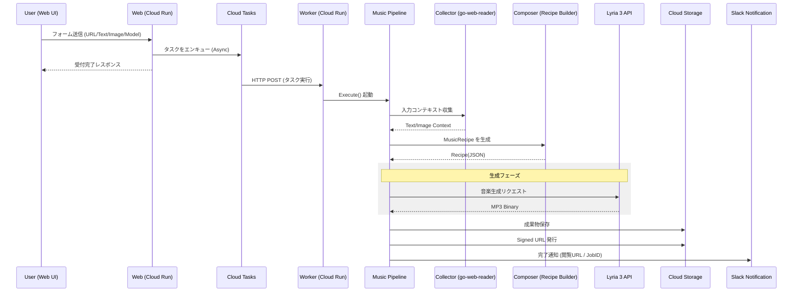

# 🎼 AP Music

[](https://golang.org/)
[](https://golang.org/)
[](https://github.com/shouni/ap-music/tags)
[](https://opensource.org/licenses/MIT)

## 🚀 概要 (About) - 音楽生成のWebオーケストレーター

**AP Music** は、音楽生成コア機能（`Lyria 3` + `Music Recipe`）を  
**Cloud Run** および **Google Cloud Tasks** で Web アプリケーション化し、非同期にオーケストレーションするためのプロジェクトです。

Web フォーム経由で入力された URL / テキスト / 画像をジョブとしてキュー投入し、ワーカーで楽曲生成を実行します。完了時には **Slack 通知** と **署名付き URL** を発行し、生成結果を即座に共有できます。

---

## 🎨 ワークフロー (Workflows)

用途に応じて、Web UI から以下の機能を使い分けます。

| 画面 (Command) | 役割 | 主な入力 / 出力 |
| --- | --- | --- |
| **Compose** | URL / 文章 / 画像から楽曲設計図（Music Recipe）を生成 | URL・Text・Image / JSON (Recipe) |
| **Generate** | Recipe から音楽を生成 | Recipe / MP3 |
| **Publish** | 生成結果の保存と共有リンク発行 | MP3 / Signed URL |
| **Notify** | 実行完了を通知 | Job Result / Slack Message |

### 💻 実行フロー (Workflow)

1. **Request**: ユーザーが Web フォームから入力を送信。
2. **Enqueue**: `CloudTasksAdapter` がジョブを非同期投入。
3. **Worker**: Worker Handler がタスクを受信し `MusicPipeline` を起動。
4. **Pipeline**:
   - **Phase 1: Collect**: `go-web-reader` で入力コンテキスト収集。
   - **Phase 2: Compose**: LLM で `MusicRecipe` 生成。
   - **Phase 3: Generate**: `Lyria 3` で MP3 生成。
   - **Phase 4: Publish/Notify**: GCS/Local 保存、Signed URL 発行、Slack 通知。

---

## 🏗 アーキテクチャ設計 (Architecture)

本プロジェクトは、**Hexagonal Architecture (Ports and Adapters)** と  
**Serverless Orchestration (Cloud Run + Cloud Tasks)** を組み合わせた構成です。

1. **Domain 層 (The Core)**
   - `MusicRecipe`, `Task`, `PublishResult` など、外部技術に依存しないドメインモデルとポートを定義。
2. **Pipeline 層 (Orchestrator)**
   - Collect → Compose → Generate → Publish を統制し、処理順序とエラーハンドリングを担う。
3. **Server 層 (Entry Points)**
   - Web Handler: リクエスト受付とタスク投入。
   - Worker Handler: Cloud Tasks から受けたジョブを実行。
4. **Adapters 層 (Infrastructure)**
   - Lyria API / GCS / Slack / Cloud Tasks など外部サービスとの接続実装。
5. **Builder 層 (Dependency Injection)**
   - Web 実行系と Worker 実行系を用途別に組み立てる DI コンテナ。

---

## 🏗 プロジェクトレイアウト (Project Layout)

```text
ap-music/
├── assets/            # 静的プロンプト、テンプレート、設定資産
├── internal/
│   ├── adapters/      # Lyria, Cloud Tasks, Storage, Slack 連携
│   ├── app/           # Container とライフサイクル管理
│   ├── builder/       # DI 構築（Web/Worker）
│   ├── config/        # 環境変数ロード、定数、バリデーション
│   ├── domain/        # ドメインモデルと Port 定義
│   ├── pipeline/      # MusicPipeline の実行制御
│   ├── prompts/       # Recipe 生成プロンプト組み立て
│   └── server/        # Web/Worker ハンドラー、ルーティング
├── docs/              # 設計ドキュメント、図、サンプル
├── main.go            # アプリケーション起動
└── README.md
```

---

## 🔄 シーケンスフロー (Sequence Flow)



---

## ✨ 技術スタック (Technology Stack)

| 要素 | 技術 / ライブラリ | 役割 |
| --- | --- | --- |
| **言語** | **Go (Golang)** | Web サーバーおよびワーカー実装 |
| **Web** | **Cloud Run** | Web UI/API と Worker の実行基盤 |
| **非同期実行** | **Google Cloud Tasks** | 楽曲生成ジョブの非同期キューイング |
| **コンテキスト収集** | **go-web-reader** | URL / 画像の収集と抽出 |
| **音楽生成** | **Lyria 3 API** | Recipe ベースの音楽生成 |
| **結果保存** | **go-remote-io / GCS** | MP3 保存、署名付き URL 発行 |
| **通知** | **Slack Webhook** | 実行完了通知 |

---

## 🚀 使い方 (Usage)

### 1. Web 経由の基本フロー

1. Web UI で入力（URL/Text/Image）とモデルを指定。
2. ジョブ送信後、Cloud Tasks へ非同期投入。
3. Worker が楽曲生成し、保存先 URI と Signed URL を発行。
4. Slack 通知で結果を受け取る。

### 2. 主要な環境変数

| 環境変数 | 説明 |
| --- | --- |
| `SERVICE_URL` | アプリの公開 URL |
| `GCP_PROJECT_ID` | GCP プロジェクト ID |
| `GCP_LOCATION_ID` | 使用リージョン |
| `CLOUD_TASKS_QUEUE_ID` | Cloud Tasks キュー名 |
| `SERVICE_ACCOUNT_EMAIL` | タスク実行に使うサービスアカウント |
| `TASK_AUDIENCE_URL` | OIDC Audience |
| `GCS_MUSIC_BUCKET` | 生成 MP3 の保存先バケット |
| `LYRIA_MODEL` | 使用する Lyria モデル名 |
| `SLACK_WEBHOOK_URL` | 完了通知先 Webhook URL |

---

## 🔗 エコシステム連携 (Evolution)

- **[AP Chain](https://github.com/shouni/ap-chain) 連携**: 構造化ドキュメントからテーマ曲を自動生成。
- **[AP Voice](https://github.com/shouni/ap-voice) 連携**: ナレーション音声と BGM を合成し音声コンテンツ化。
- **[AP Manga Web](https://github.com/shouni/ap-manga-web) 連携**: 作品ページやシーンごとのBGMを非同期生成。

---

## 📜 ライセンス (License)

このプロジェクトは [MIT License](https://opensource.org/licenses/MIT) の下で公開されています。
