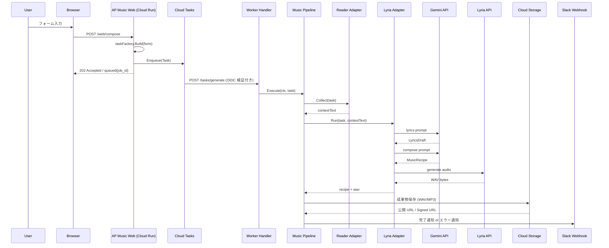

# 🎼 AP Music(Provisional)

[](https://golang.org/)
[](https://cloud.google.com/run)
[](https://golang.org/)
[](https://github.com/shouni/ap-music/tags)
[](https://opensource.org/licenses/MIT)
[](#)

## 🚀 概要 (About) - 音楽生成のWebオーケストレーター

**AP Music** は、音楽生成コア機能（`Lyria 3 Pro` + `Music Recipe`）を **Cloud Run** および **Google Cloud Tasks** で Web アプリケーション化し、非同期にオーケストレーションするためのプロジェクトです。

本プロジェクトの最大の特徴は、**Lyria 3 Pro による WAV 直接出力**と、**独自開発のバイナリ結合ロジック**を組み合わせた高品質な音声生成パイプラインです。複数の楽曲パーツを並列生成し、ロスレスで統合することで、複雑な構成の楽曲生成を高速かつ安定して実現します。

### 🎨 概要イメージ


---

## ✨ コア・コンセプト (Core Concepts)

**"Designed for 'Techno-Futurism': 技術ドキュメントを、90s デジタル・レイヴの疾走感とともに音声化する特化型オーケストレーター"**

本プロジェクトは、大規模な楽曲生成パイプラインにおいて「音楽的クオリティ」と「システム的堅牢性」を両立させるため、以下の4つの柱を基盤としています。

### 🧬 3-Factor Music Consistency
Lyria 3 Pro のポテンシャルを極限まで引き出し、生成される楽曲の「質感」と「構成」を厳密に制御（Control）します。
* **Seed Determinism**: 楽曲の乱数シードを厳密に管理。同一の `MusicRecipe` に対し、再現可能な生成結果を保証。
* **Stylistic Prompting**: 90年代のデジタルサウンド（Supersaw, 16-bit Arpeggio等）を言語的に定義し、AIに音楽的文脈を強制注入。
* **Vocal Articulation**: セクションごとの熱量指定と「passionate enunciation」の強制注入により、グローバルモデルから「熱き日本語の魂」を呼び起こす。

### 🛡 Production-Ready Concurrency Control
APIの物理的制約を超え、決して「止まらない、壊れない」パイプラインを標準装備しています。
* **Throttling Semaphore**: 並列実行数をセマフォで厳密に統制。APIのクォータを遵守し、`RESOURCE_EXHAUSTED` (429) エラーを未然に封殺。
* **Resilient Retry**: 一時的なネットワーク障害やタイムアウトに対し、Exponential Backoff（指数バックオフ）による戦略的再試行を適用し、ジョブの完走を死守。

### ⚡ Smart Request & Stream Management
オーバーヘッドを極限まで削ぎ落とし、生成コストとスループットを最適化します。
* **Singleflight Sync**: `golang.org/x/sync/singleflight` を実装。並列処理中の重複リクエストを単一の実行に集約し、APIリソースの浪費を排除。
* **Lossless Binary Merging**: 分割生成された WAV セクションを、デコードなしでバイナリレベルで直接結合。世代損失（音質劣化）をゼロに抑えた長尺楽曲構成を実現。

### 🌍 Cloud-Native Orchestration
Google Cloud のマネージドパワーをフル活用した、モダンなサーバーレス・アーキテクチャ。
* **Autoscaling Run**: Cloud Run による需要に応じたオンデマンドな計算リソースの展開。
* **Async Orchestration**: Cloud Tasks による非同期キューイング。数分間に及ぶ生成処理をバックグラウンドへ完全に隠蔽し、シームレスなUXを提供。

---

## 🎨 ワークフロー (Workflows)

| 画面 (Command) | 役割 | 主な入力 / 出力 |
| --- | --- | --- |
| **Compose** | URL / 文章 / 画像から楽曲設計図（Music Recipe）を生成 | URL・Text・Image / JSON (Recipe) |
| **Generate** | Recipe に基づき、WAV パーツを生成・結合 | Recipe / **WAV (Lossless)** |
| **Publish** | 成果物の保存と署名付き URL の発行 | WAV / Signed URL |
| **Notify** | Slack への実行完了通知 | Job Result / Slack Message |

### 💻 実行フロー (Workflow)

1. **Request**: ユーザーが Web フォームから入力を送信。
2. **Enqueue**: `CloudTasksAdapter` がジョブを非同期投入。
3. **Worker**: Worker Handler がタスクを受信し `MusicPipeline` を起動。
4. **Pipeline**:
   - **Phase 1: Collect**: `go-web-reader` で入力コンテキスト収集。
   - **Phase 2: Lyrics**: 作詞AIがキーワード抽出と歌詞案を生成。
   - **Phase 3: Compose**: 作曲AIが歌詞案を解釈して `MusicRecipe` を生成。
   - **Phase 4: Generate**: `Lyria 3` で WAV 生成。
   - **Phase 5: Publish/Notify**: GCS/Local 保存、Signed URL 発行、Slack 通知。

---

## 🏗 アーキテクチャ設計 (Architecture)

本プロジェクトは、**Hexagonal Architecture (Ports and Adapters)** と  
**Serverless Orchestration (Cloud Run + Cloud Tasks)** を組み合わせた構成です。

1. **Domain 層 (The Core)**
   - `MusicRecipe`, `Task`, `PublishResult` など、外部技術に依存しないドメインモデルとポートを定義。
2. **Pipeline 層 (Orchestrator)**
   - Collect → Lyrics → Compose → Generate → Publish を統制し、処理順序とエラーハンドリングを担う。
3. **Server 層 (Entry Points)**
   - Web Handler: リクエスト受付とタスク投入。
   - Worker Handler: Cloud Tasks から受けたジョブを実行。
4. **Adapters 層 (Infrastructure)**
   - Lyria API / GCS / Slack / Cloud Tasks など外部サービスとの接続実装。
5. **Builder 層 (Dependency Injection)**
   - Web 実行系と Worker 実行系を用途別に組み立てる DI コンテナ。

---

## 🏗 プロジェクトレイアウト (Project Layout)

```text
ap-music/
├── main.go                         # エントリーポイント
├── Dockerfile                      # Cloud Run 向けコンテナ定義
├── assets/                         # embed.FS で配布する静的資産
│   ├── assets.go                   # 埋め込みファイルの公開 API
│   ├── prompts/                    # 作詞・作曲用プロンプトテンプレート
│   └── templates/                  # Web UI テンプレート
│       ├── compose_form.html       # 楽曲生成フォーム
│       ├── accepted.html           # 受付完了画面
│       └── layout.html             # 共通レイアウト
├── docs/                           # ドキュメント用画像などの補助資料
├── internal/
│   ├── adapters/                   # 外部サービス接続の実装
│   │   ├── reader.go               # URL / テキスト / 画像入力の収集
│   │   ├── prompt.go               # プロンプト組み立て
│   │   ├── lyria*.go               # Gemini / Lyria を使う作詞・作曲・音声生成
│   │   ├── publisher.go            # GCS 保存と署名付き URL 発行
│   │   ├── slack.go                # Slack 通知
│   │   └── *_test.go               # アダプタ単体テスト
│   ├── app/                        # DI コンテナと共有リソース定義
│   ├── builder/                    # Config から依存関係を構築
│   │   ├── app.go                  # 全コンポーネントの組み立て
│   │   ├── handlers.go             # Auth / Web / Worker Handler の生成
│   │   ├── io.go                   # RemoteIO / GCS 初期化
│   │   ├── pipeline.go             # MusicPipeline の配線
│   │   └── task.go                 # Cloud Tasks Enqueuer の初期化
│   ├── config/                     # 環境変数ロードと設定検証
│   ├── domain/                     # ドメインモデルと Port 定義
│   │   ├── service.go              # Pipeline / Collector / Runner の契約
│   │   ├── task.go                 # 非同期ジョブ payload
│   │   ├── music_recipe.go         # 楽曲レシピと歌詞ドラフト
│   │   ├── repository.go           # 出力公開の契約
│   │   └── notification.go         # 通知の契約
│   ├── pipeline/
│   │   └── music_pipeline.go       # Collect -> Run -> Publish -> Notify の統制
│   └── server/                     # HTTP サーバーとルーティング
│       ├── handlers/
│       │   ├── handler.go          # Web UI の表示とテンプレート描画
│       │   ├── task_factory.go     # フォーム入力から Task を生成
│       │   └── *_test.go           # ハンドラー周辺のテスト
│       ├── router.go               # 認証付き Web / Worker ルート定義
│       └── server.go               # サーバー起動と graceful shutdown
├── go.mod
└── go.sum
```

---

## 🔄 シーケンスフロー (Sequence Flow)



---

## ✨ 技術スタック (Technology Stack)

| 要素 | 技術 / ライブラリ | 役割 |
| --- | --- | --- |
| **言語** | **Go (Golang)** | Web サーバーおよびワーカー実装 |
| **Web** | **Cloud Run** | Web UI/API と Worker の実行基盤 |
| **非同期実行** | **Google Cloud Tasks** | 楽曲生成ジョブの非同期キューイング |
| **コンテキスト収集** | **go-web-reader** | URL / 画像の収集と抽出 |
| **音楽生成** | **Lyria 3 API** | Recipe ベースの音楽生成 |
| **結果保存** | **go-remote-io / GCS** | WAV 保存、署名付き URL 発行 |
| **通知** | **Slack Webhook** | 実行完了通知 |

---

## 🚀 使い方 (Usage)

### 1. Web 経由の基本フロー

1. Web UI で入力（URL/Text/Image）とモデルを指定。
2. ジョブ送信後、Cloud Tasks へ非同期投入。
3. Worker が楽曲生成し、保存先 URI と Signed URL を発行。
4. Slack 通知で結果を受け取る。

### 2. 主要な環境変数

| 環境変数 | 必須 | 説明 |
| --- | :---: | --- |
| `SERVICE_URL` | 必須 | アプリの公開 URL |
| `GCP_PROJECT_ID` | 必須 | GCP プロジェクト ID |
| `GCP_LOCATION_ID` | 必須 | 使用リージョン |
| `CLOUD_TASKS_QUEUE_ID` | 必須 | Cloud Tasks キュー名 |
| `SERVICE_ACCOUNT_EMAIL` | 必須 | タスク実行に使うサービスアカウント |
| `TASK_AUDIENCE_URL` | 任意 | OIDC Audience (認証が必要な場合) |
| `GCS_MUSIC_BUCKET` | 必須 | 生成 WAV の保存先バケット |
| `LYRIA_MODEL` | 任意 | 使用する Lyria モデル名 (デフォルト値がある場合) |
| `SLACK_WEBHOOK_URL` | 任意 | 完了通知先 Webhook URL |

---

### 🔗 エコシステム連携 (Evolution)

- **[AP Chain](https://github.com/shouni/ap-chain) 連携**: 構造化ドキュメントからテーマ曲を自動生成。
- **[AP Voice](https://github.com/shouni/ap-voice) 連携**: ナレーション音声と BGM を合成し音声コンテンツ化。
- **[AP Manga Web](https://github.com/shouni/ap-manga-web) 連携**: 作品ページやシーンごとのBGMを非同期生成。

---

### 📜 ライセンス (License)

* デフォルトキャラクター: VOICEVOX:ずんだもん、VOICEVOX:四国めたん
* このプロジェクトは [MIT License](https://opensource.org/licenses/MIT) の下で公開されています。
