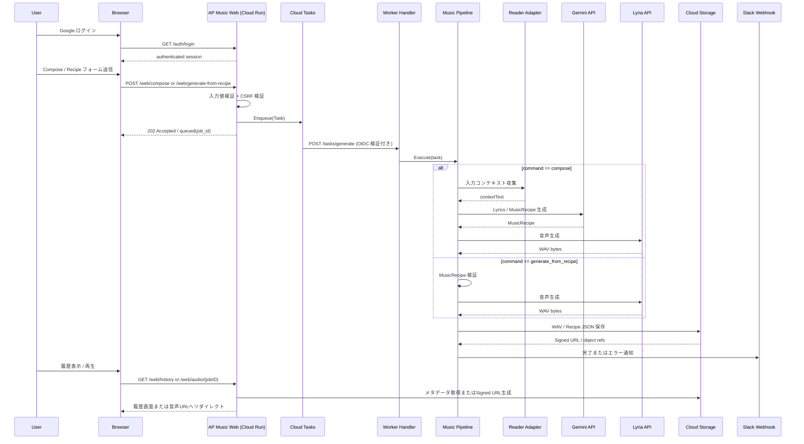

# 🎼 AP Music

[](https://golang.org/)
[](https://cloud.google.com/run)
[](https://golang.org/)
[](https://github.com/shouni/ap-music/tags)
[](https://opensource.org/licenses/MIT)
[](https://goreportcard.com/report/github.com/shouni/ap-music)
[](#)

## 🚀 概要 (About)

**AP Music** は、AI音楽生成オーケストレーターの公開ショーケース版です。

本リポジトリでは、アーキテクチャ、非同期ワークフロー、Cloud Run / Cloud Tasks / GCS による実装、生成体験を公開しています。位置づけは商用プロダクトではなく、**PoC / Technical Demonstration** です。

公開版では、プロンプト、生成品質制御、運用設定などをショーケース向けに簡略化しています。このリポジトリでは、AI音楽生成システムをどのようにWebアプリケーション化し、非同期ジョブとして安全に扱うかを示すことに焦点を置いています。

---

## ✨ このリポジトリで見せていること

AP Music は、ユーザー入力から楽曲設計図を作成し、音声生成、保存、再生、履歴管理までを非同期に扱うWebアプリケーションです。

公開版では、主に以下を確認できます。

- Go による Web / Worker 実装
- Cloud Run を前提にしたサーバーレス構成
- Cloud Tasks による長時間処理の非同期化
- GCS への WAV / Recipe JSON 保存
- Google OAuth、セッション、CSRF、Cloud Tasks OIDC による保護
- 生成ジョブの投入、履歴表示、音声再生、削除までのユーザー体験
- Hexagonal Architecture に近い責務分離
- AI API 連携をアプリケーション境界へ閉じ込める設計

---

## 🧭 公開ショーケースとしての境界

このリポジトリは、実装力と設計思想を見せるための公開版です。以下はショーケース用途に合わせて簡略化しています。

- プロンプトテンプレート
- 生成品質制御の詳細
- モデルごとの細かな制御
- 運用環境の具体設定
- 検証・改善フロー

そのため、公開版のプロンプトや音声生成指示は、動作と設計を理解するためのサンプルとして抽象化しています。

---

## 🎨 ワークフロー (Workflows)

| 画面 / Command | 役割 | 主な入力 / 出力 |
| --- | --- | --- |
| **Compose** (`compose`) | URL / 文章 / 画像から楽曲設計図を作成し、音声生成まで実行 | URL・Text・Image / Recipe JSON・WAV |
| **Generate from Recipe** (`generate_from_recipe`) | 入力済み `MusicRecipe` から音声生成と保存だけを実行 | MusicRecipe JSON / WAV・Recipe JSON |
| **Publish** | 生成成果物をGCSへ保存し、参照URLを発行 | WAV・Recipe JSON / Signed URL |
| **Playback** | 履歴画面からGCS上の音声を署名付きURL経由で再生 | Job ID / Audio Playback |
| **History** | 生成履歴を一覧・詳細表示し、再生・JSON確認・削除を提供 | Job ID / Audio Preview・Recipe JSON |
| **Notify** | ジョブ完了やエラーをSlackへ通知 | Job Result / Slack Message |

---

## 💻 実行フロー (Workflow)

1. ユーザーが Google OAuth でログインします。
2. Webフォームから `compose` または `generate_from_recipe` を送信します。
3. Web Handler が入力値と CSRF トークンを検証します。
4. ジョブを Cloud Tasks に投入し、Web側は即座に queued レスポンスを返します。
5. Cloud Tasks が OIDC トークン付きで Worker Handler を呼び出します。
6. Worker が `Task.command` に応じて生成パイプラインを実行します。
7. 生成された WAV と Recipe JSON を GCS に保存します。
8. Slack へ完了またはエラーを通知します。
9. ユーザーは履歴画面から再生、詳細確認、削除を行えます。

---

## 🏗 アーキテクチャ設計 (Architecture)

本プロジェクトは、**Hexagonal Architecture (Ports and Adapters)** と **Serverless Orchestration (Cloud Run + Cloud Tasks)** を組み合わせた構成です。

| 層 | 役割 |
| --- | --- |
| **Domain** | `MusicRecipe`, `Task`, `TaskCommand`, `PublishResult` など、外部技術に依存しないモデルとポートを定義 |
| **Pipeline** | `Task.command` に応じて通常生成またはRecipe直接生成を統制し、Publish / Notify までを扱う |
| **Server** | Auth、Web UI、Cloud Tasks Worker などHTTPエントリーポイントを提供 |
| **Adapters** | AI API、GCS、Slack、Cloud Tasks、Reader など外部サービス接続を実装 |
| **Builder** | Web実行系とWorker実行系の依存関係を組み立てる |
| **Repository** | GCS上の履歴一覧、Recipe取得、成果物削除、キャッシュを担当 |

---

## 🏗 プロジェクトレイアウト (Project Layout)

```text
ap-music/
├── main.go                 # エントリーポイント
├── Dockerfile              # Cloud Run 向けコンテナ定義
├── assets/                 # embed.FS で配布する静的資産
│   ├── prompts/            # 公開版向けに抽象化したプロンプトテンプレート
│   └── templates/          # Web UI テンプレート
└── internal/
    ├── adapters/           # AI API / GCS / Slack / Cloud Tasks など外部サービス接続
    ├── app/                # DIコンテナと共有リソース定義
    ├── builder/            # Configから依存関係を構築
    ├── config/             # 環境変数ロードと設定検証
    ├── domain/             # ドメインモデルとPort定義
    ├── pipeline/           # command別の生成フローとPublish / Notifyの統制
    ├── repository/         # GCS上の履歴一覧・レシピ取得・削除
    └── server/             # HTTPサーバー、ルーティング、ハンドラー
```

---

## 🔄 シーケンスフロー (Sequence Flow)



---

## ✨ 技術スタック (Technology Stack)

| 要素 | 技術 / ライブラリ | 役割 |
| --- | --- | --- |
| **言語** | **Go** | Webサーバーおよびワーカー実装 |
| **実行基盤** | **Cloud Run** | Web UI/API と Worker のホスティング |
| **非同期実行** | **Google Cloud Tasks** | 楽曲生成ジョブのキューイング |
| **保存先** | **Google Cloud Storage** | WAV / Recipe JSON の保存、署名付きURL発行 |
| **テキスト生成** | **Gemini API** | 歌詞案とMusicRecipe生成 |
| **音声生成** | **Lyria API** | Recipeベースの音声生成 |
| **通知** | **Slack Webhook** | 完了・エラー通知 |
| **HTTPルーティング** | **chi** | Web / Auth / Worker ルート構成 |
| **認証・保護** | **Google OAuth / Session / CSRF / OIDC** | ユーザー認証と副作用のある操作の保護 |
| **UI** | **Bootstrap / Bootstrap Icons** | フォーム、履歴、詳細、音声プレビュー表示 |

---

## 🚀 使い方 (Usage)

### 1. Web経由の基本フロー（Compose）

1. Google OAuth でログインします。
2. `/` のフォームで入力ソースを1つ以上指定します。
3. 必要なら `compose_mode`、`lyrics_model`、`compose_model`、`seed` を指定します。
4. 送信後、CSRFトークンが検証され、ジョブはCloud Tasksに投入されます。
5. Workerが生成処理を実行し、GCS上に `WAV` と `Recipe JSON` を保存します。
6. `/web/history` から過去の生成ジョブを一覧し、再生・詳細確認・削除ができます。

### 2. MusicRecipe JSONからGenerate / Publishだけ実行

1. Google OAuth でログインします。
2. `/web/generate-from-recipe` を開き、`MusicRecipe` JSONを入力します。
3. 必要なら `compose_model` と `seed` を指定します。
4. 送信時にJSONは `MusicRecipe` 構造体へデコードされ、最低限の内容が検証されます。
5. WorkerはCollect / Lyrics / Composeをスキップし、音声生成、GCS保存、Slack通知のみ実行します。

---

## 入力と生成オプション

Composeフォームでは次の項目を受け付けます。

| 項目 | 必須 | 説明 |
| --- | :---: | --- |
| `url` | 任意 | 参照元URL。本文はReader Adapterで収集されます |
| `text` | 任意 | コンセプト文や歌詞ドラフト |
| `image` | 任意 | 参照画像URL。画像を取得し、マルチモーダル入力として扱います |
| `compose_mode` | 任意 | `assets/prompts/compose_*.md` から読み込むプロンプトモード |
| `lyrics_model` | 任意 | 作詞・レシピ生成に使うテキストモデル |
| `compose_model` | 任意 | 音声生成モデル名 |
| `seed` | 任意 | 再現性確認用のシード値。空ならランダム |

`url` / `text` / `image` のうち少なくとも1つは必要です。

Generate from Recipeフォームでは次の項目を受け付けます。

| 項目 | 必須 | 説明 |
| --- | :---: | --- |
| `recipe_json` | 必須 | `MusicRecipe` JSON。送信前に構造体へデコード・検証されます |
| `compose_model` | 任意 | このジョブで上書きする音声生成モデル名 |
| `seed` | 任意 | このジョブで上書きするシード値 |

---

## 主要な環境変数

| 環境変数 | 必須 | 説明 |
| --- | :---: | --- |
| `PORT` | 任意 | HTTPサーバーの待受ポート。既定値: `8080` |
| `SERVICE_URL` | 必須 | アプリの公開URL。本番ではHTTPS必須 |
| `GCP_PROJECT_ID` | 必須 | GCPプロジェクトID |
| `GCP_LOCATION_ID` | 必須 | 使用リージョン |
| `CLOUD_TASKS_QUEUE_ID` | 必須 | Cloud Tasksキュー名 |
| `SERVICE_ACCOUNT_EMAIL` | 必須 | タスク実行に使うサービスアカウント |
| `TASK_AUDIENCE_URL` | 任意 | Cloud TasksのOIDC Audience。未指定時は `SERVICE_URL` |
| `GCS_MUSIC_BUCKET` | 必須 | 生成WAVとRecipe JSONの保存先バケット |
| `GEMINI_API_KEY` | 必須 | AI API呼び出しに使うAPIキー |
| `GEMINI_MODEL` | 任意 | 作詞・作曲フェーズの既定モデル |
| `LYRIA_MODEL` | 任意 | 音声生成フェーズの既定モデル |
| `MAX_CONCURRENCY` | 任意 | 音声生成の最大並列数 |
| `RATE_INTERVAL_SEC` | 任意 | 音声生成API呼び出し間隔（秒） |
| `SLACK_WEBHOOK_URL` | 任意 | 完了・エラー通知先Webhook URL |
| `GOOGLE_CLIENT_ID` | 必須 | Google OAuth Client ID |
| `GOOGLE_CLIENT_SECRET` | 必須 | Google OAuth Client Secret |
| `SESSION_SECRET` | 必須 | セッション署名キー |
| `SESSION_ENCRYPT_KEY` | 必須 | セッション暗号化キー。16 / 24 / 32 バイト |
| `ALLOWED_EMAILS` | 条件付き必須 | ログイン許可メールアドレス一覧（カンマ区切り） |
| `ALLOWED_DOMAINS` | 条件付き必須 | ログイン許可ドメイン一覧（カンマ区切り） |

`ALLOWED_EMAILS` と `ALLOWED_DOMAINS` は両方空にはできません。

---

## HTTPエンドポイント

| メソッド | パス | 用途 |
| --- | --- | --- |
| `GET` | `/healthz` | ヘルスチェック |
| `GET` | `/auth/login` | Google OAuthログイン開始 |
| `GET` | `/auth/callback` | OAuthコールバック |
| `GET` | `/` | 認証済みユーザー向けの楽曲生成フォーム |
| `GET` | `/web/generate-from-recipe` | MusicRecipe JSONからGenerate / Publishを実行するフォーム |
| `GET` | `/web/history` | 生成履歴一覧 |
| `GET` | `/web/history/{jobID}` | 楽曲詳細、音声プレビュー、Recipe JSON表示 |
| `GET` | `/web/audio/{jobID}` | Job IDを検証し、GCSのWAV署名付きURLへリダイレクト |
| `POST` | `/web/compose` | Composeフォーム送信とジョブ投入 |
| `POST` | `/web/generate-from-recipe` | MusicRecipe JSONの検証とジョブ投入 |
| `DELETE` | `/web/history/{jobID}` | 生成履歴と関連ファイルの削除 |
| `POST` | `/tasks/generate` | Cloud Tasksから呼ばれるWorkerエンドポイント |

---

## 📜 ライセンス (License)

このプロジェクトは [MIT License](https://opensource.org/licenses/MIT) の下で公開されています。
