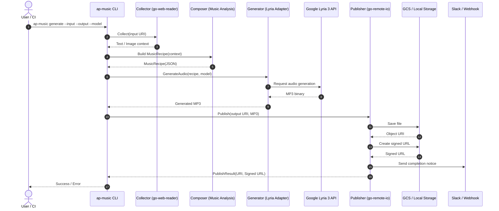

# 🎼 AP Music (Provisional)

[](https://golang.org/)
[](https://golang.org/)
[](https://github.com/shouni/ap-music/tags)
[](https://opensource.org/licenses/MIT)

## 🌟 概要: 多次元コンテキストの解析とAI楽曲生成のパイプライン

**AP Music** は、Google の最新音楽生成モデル **Lyria 3** をコアエンジンに採用した、次世代の AI 音楽生成パイプラインです。Web コンテンツの論理構造や画像が持つ視覚的な「空気感」を AI で解析し、高品質な 44.1 kHz ステレオ音声（MP3）を自動生成する Go 言語製 CLI ツールとして設計されています。

単なる音楽生成ツールではなく、**「情報を音に変換する」** というコンセプトのもと、以下の強力なツール群の設計思想とコンポーネントを継承・統合しています。

* **[AP Chain](https://github.com/shouni/ap-chain)** (LLMマルチステップパイプライン)
    * **情報の再構築**: 大規模情報の構造化、および MapReduce 処理による楽曲設計図（Music Recipe）の抽出ロジックを継承。
* **[AP Voice](https://github.com/shouni/ap-voice)** (音声化パイプライン)
    * **堅牢な実行基盤**: Go 言語による高度な並列制御、リトライ機構、およびクラウド最適化された I/O 基盤（GCS/Local）を継承。

---

### キャッチフレーズのポイント
* **「多次元コンテキスト」**: テキスト（論理）と画像（感性）の両方を扱うマルチモーダルな特性を表現しました。
* **「情報を音に変換する」**: 既存の `AP Chain` が「情報を構造化」するのと対比させ、このツールの独自の存在意義を定義しています。
* **「アーキテクチャの継承」**: 箇条書き部分に「再構築」「実行基盤」という言葉を添えることで、エンジニアリングとしての信頼感を演出しました。

この概要であれば、リポジトリのトップに置いた際、非常にプロフェッショナルかつ野心的なプロジェクトに見えます。

---

## 🛠️ アーキテクチャと設計思想

既存の `shouni` エコシステム（`go-remote-io`, `go-web-reader` 等）を最大限に活用し、**Hexagonal Architecture (Ports and Adapters)** に基づいて構築されます。

### 🔄 ワークフロー・シーケンス

1.  **Collector ([go-web-reader](https://github.com/shouni/go-web-reader))**:
    * 指定された URI（Web URL, GCS, Local）からテキストや画像バイナリを収集。
2.  **Composer (Music Analysis)**:
    * **AP Chain** の手法を応用し、収集したコンテキストから楽曲の「設計図（Music Recipe）」を JSON 形式で生成。
3.  **Generator (Lyria Adapter)**:
    * **Lyria 3** API を介し、Recipe に基づいた高品質 MP3 を生成。
4.  **Publisher ([go-remote-io](https://github.com/shouni/go-remote-io))**:
    * **AP Voice** 同様の保存・通知機構を用い、GCS/Local へ保存し、署名付き URL を発行。

## 🔄 シーケンスフロー (Sequence Flow)



-----

## ✨ 主要な機能

### 1\. マルチモーダル・インプット

* **テキスト解析**: 技術ドキュメントやニュース記事から歌詞や感情を抽出。
* **画像解析**: 写真やイラストの視覚情報から、ジャンルや楽器構成を自動決定。

### 2\. Music Recipe 構造体

AI が生成する中間データ構造により、楽曲生成の透明性と制御性を確保します。

```go
type MusicRecipe struct {
    Genre       string   `json:"genre"`       // 例: Lo-fi, Cinematic, Jazz
    Mood        string   `json:"mood"`        // 例: Calm, Energetic, Sad
    Tempo       int      `json:"tempo"`       // BPM
    Lyrics      string   `json:"lyrics"`      // 歌唱用歌詞
    Instruments []string `json:"instruments"` // 使用される楽器リスト
}
```

### 3\. クラウドネイティブ I/O

* **AP Voice** の設計を継承し、**GCS (`gs://`)** を透過的にサポート。
* 生成結果を即座に安全な **Signed URL** で共有し、Slack 等へ通知。

-----

## 🚀 使い方 (Usage)

### CLI コマンド形式

```bash
# Web記事の内容に基づいたBGMを生成しGCSへ保存
ap-music generate \
    --input "https://example.com/tech-article" \
    --output "gs://my-bucket/bgm/article-theme.mp3" \
    --model lyria-3-pro-preview

# ローカルの画像から30秒のクリップを生成
ap-music generate \
    -i "./assets/photo.jpg" \
    -o "./output/preview.mp3" \
    --model lyria-3-clip-preview
```

-----

## 🌳 プロジェクト構成

`ap-chain` のディレクトリ構造、しっかりと把握いたしました。

このレイアウトは、あなたが重視されている **Hexagonal Architecture (Ports and Adapters)** と **Dependency Injection** の思想が色濃く反映された、非常に拡張性の高い構成ですね。

この構造をベースに `ap-music` を構築する場合、以下のようにコンポーネントを配置・拡張していくことで、既存の資産を最短距離で転用できます。

---

### 🎼 AP Music へのレイアウト適用案

基本構造は `ap-chain` を踏襲し、音楽生成特有のロジックを各層に配置します。

```text
ap-music/
├── assets/
│   ├── assets.go
│   └── prompts/
│       └── prompt_music_recipe.md  # インプットから楽曲設計図(JSON)を抽出するプロンプト
├── cmd/
│   ├── generate.go                 # 先ほど定義した generateCmd
│   └── root.go
├── internal/
│   ├── adapters/
│   │   ├── lyria.go                # Lyria 3 API (genai.Client) の実装アダプター
│   │   ├── prompt.go               # go-prompt-kit を用いた音楽プロンプト処理
│   │   └── slack.go                # 通知用（既存の ap-chain/voice から流用可能）
│   ├── app/
│   │   └── container.go            # 依存関係の注入（Container 構造体）
│   ├── builder/
│   │   ├── app.go                  # コンテナビルドロジック
│   │   ├── pipeline.go             # MusicPipeline の組み立て
│   │   └── runners.go              # 各 Runner (Collect/MusicGen/Publish) の初期化
│   ├── domain/
│   │   ├── music.go                # MusicRecipe 構造体の定義
│   │   ├── ports.go                # MusicGenerator / MusicAnalyzer 等のインターフェース
│   │   └── request.go              # InputURI や OutputURI を含むリクエスト定義
│   ├── pipeline/
│   │   └── pipeline.go             # 実行順序の制御 (Collect -> Analyze -> Generate -> Publish)
│   └── runner/
│       ├── collect.go              # テキスト/画像収集 (go-web-reader)
│       ├── music_gen.go            # Lyria 3 を叩いて MP3 を生成するメイン Runner
│       └── publish.go              # 保存、署名URL発行、通知 (go-remote-io)
├── main.go
└── README.md
```

---

### 🚀 既存レイアウトからの進化・統合ポイント

1.  **`internal/domain/music.go` の新設**:
    `ap-chain` では情報の構造化（Result）が中心でしたが、ここでは `MusicRecipe`（ジャンル、BPM、楽器構成）をドメインモデルの核に据えます。
2.  **`internal/adapters/lyria.go` の追加**:
    あなたの `go-gemini-client` を拡張し、`genai.Client` を使って音楽バイナリを取得するアダプターをここへ配置します。
3.  **マルチモーダル対応 (`runner/collect.go`)**:
    `go-web-reader` を利用し、テキストだけでなく画像データも `[]byte` として取得・保持し、後続の `lyria` アダプターに渡せるよう拡張します。
4.  **`internal/builder` での統合**:
    `ap-chain` で培われた「クリーンな依存関係の構築」をそのまま利用できるため、`main.go` から `builder.BuildContainer` を呼ぶだけで、複雑な音楽生成パイプラインが立ち上がるようになります。

-----

## 🔗 エコシステムとの連携 (Evolution)

* **AP Chain 連携**: 構造化したレポートに、その内容を象徴するテーマソングを自動付与。
* **AP Voice 連携**: **AP Voice** で生成したナレーション（WAV）と、本ツールで生成した BGM（MP3）を FFmpeg で合成し、完全自動でオーディオコンテンツを出力。

-----

## ⚠️ 実装上の注意点

* **フォーマットの差異**: VOICEVOX (WAV) と Lyria 3 (MP3) の差異に注意。
* **非同期処理の重要性**: 長尺の `lyria-3-pro-preview` 生成時は、**AP Manga Web** で培った Cloud Tasks 等による非同期構成が有効。

## 📜 ライセンス (License)

このプロジェクトは [MIT License](https://opensource.org/licenses/MIT) の下で公開されています。

